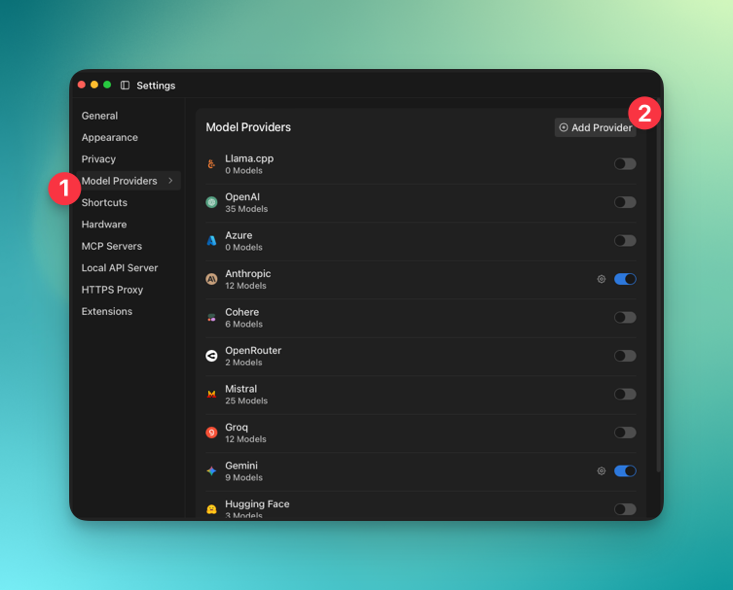
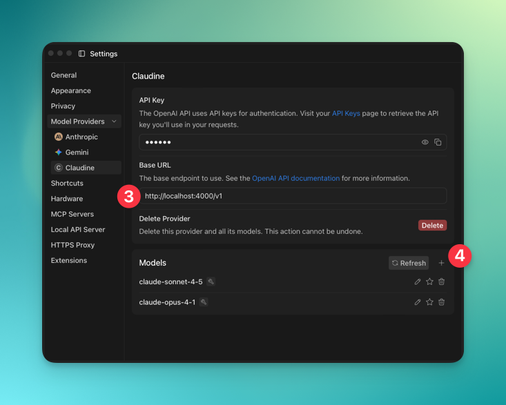
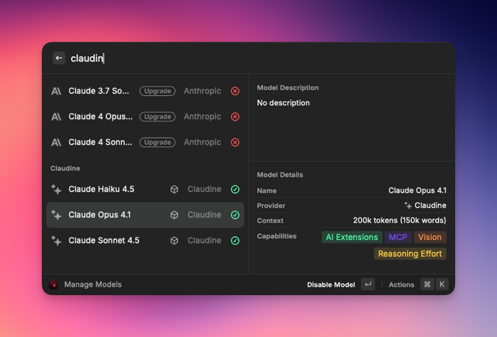
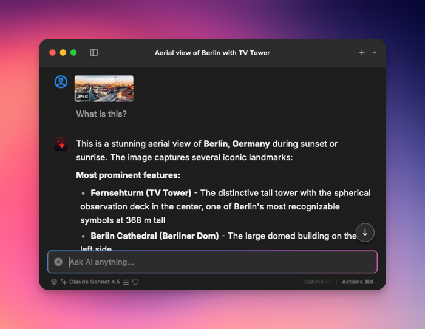
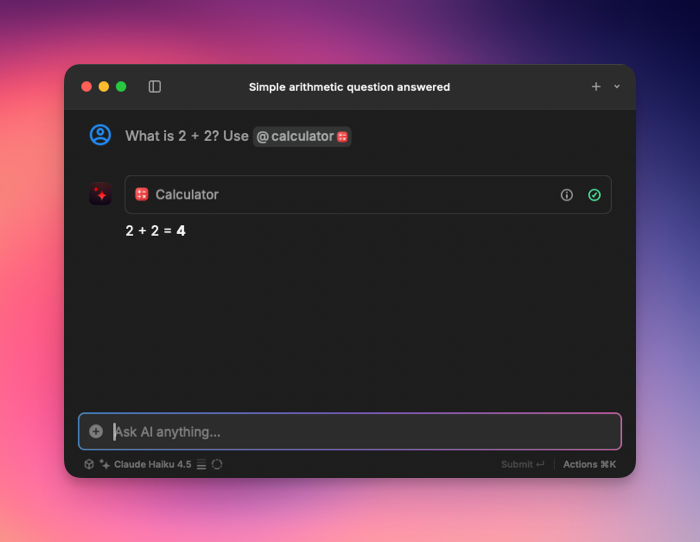

<h1>
  <picture>
    <source width="466" media="(prefers-color-scheme: dark)" srcset="assets/banner.gif">
    
  </picture>
</h1>

<br />

<p><b>Use Your Claude Subscription Everywhere</b></p>
<p>
  <b>Claudine</b> is a lightweight, session-free OAuth ambassador for Claude. It is designed for low-latency streaming and can be deployed as a local sidecar or as a shared service for development.
  <br /><br />
</p>

---

✅ **OpenAI Compatibility:** A drop-in, OpenAI-compatible endpoint for `v1/chat/completions` makes integration with existing **OpenAI SDK** and tools like **Jan.ai** or **Raycast** zero-effort.

✅ **Resilient Authentication:** Handles OAuth2 flow and token refresh, ensuring connections are long-lived and stable.

✅ **Privacy by Design:** Designed as a pass-through proxy; never logs credentials or request/response bodies.

✅ **Designed for Observability:** Structured JSON logs with built-in trace correlation using W3C Trace Context.

---

<br />

<p>
<a href="https://github.com/florianilch/claudine-proxy/releases/latest"></a>
<a href="https://github.com/florianilch/claudine-proxy/actions/workflows/ci.yml"></a>
<br /><br />
</p>

## 🚀 60-Second Quick Start

**1. Install**

Via Homebrew (recommended for **macOS**):

```bash
brew install --cask florianilch/tap/claudine
```

For direct control, grab the [latest release](https://github.com/florianilch/claudine-proxy/releases/latest) for **Windows**, **Linux** or **macOS** and move it into your `PATH`.

**2. Authenticate**

```bash
claudine auth login
```

This kicks off a one-time login with your Claude account. Just follow the link, authorize the app using your Claude Pro/Max account and paste the code. Done.

**3. Run the Proxy**

```bash
claudine start
```
Claudine is now running at `http://localhost:4000`.

## Usage

Point any client or SDK at `http://localhost:4000`.

See [Anthropic's model docs](https://docs.anthropic.com/en/docs/about-claude/models) for available models.

### Native Anthropic API

Use this for tools that support Anthropic's API but not its OAuth flow.

```bash
curl http://localhost:4000/v1/messages \
  -H "Content-Type: application/json" \
  -H "x-api-key: claudine" \
  -H "anthropic-version: 2023-06-01" \
  -d '{
    "model": "claude-sonnet-4-0",
    "messages": [{"role": "user", "content": "Hello!"}],
    "max_tokens": 1024
  }'
```

**For SDK usage:**
- Point `base_url` to `http://localhost:4000`
- Set `api_key` to any value (proxy handles auth)
- See [Anthropic Python SDK](https://github.com/anthropics/anthropic-sdk-python) or [TypeScript SDK](https://github.com/anthropics/anthropic-sdk-typescript)

### OpenAI API Compatibility

For most tools, this is all you need.

```bash
curl http://localhost:4000/v1/chat/completions \
  -H "Content-Type: application/json" \
  -H "Authorization: Bearer claudine" \
  -d '{
    "model": "claude-sonnet-4-0",
    "messages": [{"role": "user", "content": "Hello!"}]
  }'
```

**For SDK usage:**
- Point `base_url` to `http://localhost:4000/v1`
- Set `api_key` to any value (proxy handles auth)
- See [OpenAI Python SDK](https://github.com/openai/openai-python) or [Node.js SDK](https://github.com/openai/openai-node)

### Web Search

Claude can search the web to answer questions requiring current information. Enable web search by setting an environment variable:

```bash
export CLAUDINE_ENABLE_WEB_SEARCH=true
claudine start
```

Once enabled, Claude automatically decides when to search based on your queries. Results appear as markdown-formatted links in the response.

**Supported Models:**
- claude-sonnet-4-5-20250929 (Claude Sonnet 4.5)
- claude-sonnet-4-20250514 (Claude Sonnet 4)
- claude-haiku-4-5-20251001 (Claude Haiku 4.5)
- claude-opus-4 and claude-opus-4.1

**Pricing:** $10 per 1,000 searches (charged by Anthropic)

**Example queries:**
- "What are the latest developments in AI today?"
- "What's the current weather in San Francisco?"
- "Find recent news about SpaceX launches"

For OpenAI-compatible clients, you can also enable web search per-request using `web_search_options`:

```bash
curl http://localhost:4000/v1/chat/completions \
  -H "Content-Type: application/json" \
  -H "Authorization: Bearer claudine" \
  -d '{
    "model": "claude-sonnet-4-5-20250929",
    "messages": [{"role": "user", "content": "Latest AI news?"}],
    "web_search_options": {
      "user_location": {
        "type": "approximate",
        "approximate": {"city": "San Francisco"}
      }
    }
  }'
```

**Note:** OpenAI's `search_context_size` parameter is not supported (Claude manages context automatically).

## Supported Tools & Editors

Any tool that supports BYOM (Bring Your Own Models) with OpenAI-compatible endpoints works with Claudine. Here are a few popular examples:

### [Jan.ai](https://www.jan.ai/)

In Settings, add a new Model Provider pointing to `http://localhost:4000/v1` and add the models you need.




### [Raycast](https://www.raycast.com/)

Enable Custom AI providers and add Claudine to your list of custom providers.

**For web search:** Set `CLAUDINE_ENABLE_WEB_SEARCH=true` before starting Claudine. Raycast will then use Claude's web search automatically when needed.

<details>
<summary>example configuration (`providers.yaml`)</summary>

```yaml
# ~/.config/raycast/ai/providers.yaml on macOS
providers:
  # ...
  - id: claudine
    name: Claudine
    base_url: http://localhost:4000/v1
    # to enable web search in providers.yaml
    additional_parameters:
      web_search_options: {}
    models:
      - id: claude-sonnet-4-5-20250929
        name: "Claude Sonnet 4.5"
        context: 205400
        abilities:
          temperature:
            supported: true
          vision:
            supported: true
          system_message:
            supported: true
          tools:
            supported: true
          reasoning_effort:
            supported: true
      # ...
```

**To enable web search with Raycast:**
```bash
# Set environment variable before starting
export CLAUDINE_ENABLE_WEB_SEARCH=true
claudine start

# Or for macOS launchd service, add to your plist:
# <key>CLAUDINE_ENABLE_WEB_SEARCH</key><string>true</string>
```

</details>
<br />







#### Most IDEs

```jsonc
// Example for Cursor
{
  "models": [{
    "model": "claude-sonnet-4-0",
    "apiBase": "http://localhost:4000/v1",
    "apiKey": "claudine"
    // ...
  }]
}
```

## Configuration

Claudine works out-of-the-box. Customize it with CLI flags, environment variables or a config file.

```bash
# Use a different port via a CLI flag (double-hyphen for nesting)
claudine start --server--port 9000

# Or use an environment variable (prefix with CLAUDINE_ and use __ for nesting)
export CLAUDINE_SERVER__PORT=9000
claudine start
```
Run `claudine --help` for all available options.

### Environment Variables

| Variable | Description | Default |
|----------|-------------|---------|
| `CLAUDINE_LOG_LEVEL` | Logging severity level | `info` |
| `CLAUDINE_LOG_FORMAT` | Log output format (`text` or `json`) | `text` |
| `CLAUDINE_SERVER__HOST` | Server bind address | `127.0.0.1` |
| `CLAUDINE_SERVER__PORT` | Server listen port | `4000` |
| `CLAUDINE_ENABLE_WEB_SEARCH` | Enable web search for all requests | `false` |

<details>
<summary><b>View all environment variables</b></summary>

| Variable | Description | Default |
|----------|-------------|---------|
| `CLAUDINE_SHUTDOWN__DELAY` | Delay before shutdown starts | `0s` |
| `CLAUDINE_SHUTDOWN__TIMEOUT` | Graceful shutdown timeout | `10s` |
| `CLAUDINE_AUTH__STORAGE` | Token storage (`keyring`, `file`, `env`) | `keyring` |
| `CLAUDINE_AUTH__FILE` | Path for `file` storage | *Platform-dependent \** |
| `CLAUDINE_AUTH__KEYRING_USER` | Identifier for `keyring` storage | Current OS username |
| `CLAUDINE_AUTH__ENV_KEY` | Env var for `env` storage |  |
| `CLAUDINE_AUTH__METHOD` | Auth method (`oauth` or `static`) | `oauth` |
| `CLAUDINE_UPSTREAM__BASE_URL` | Upstream API base URL | `https://api.anthropic.com/v1` |

\* Default locations for file storage:
- **Linux**: `~/.config/claudine-proxy/auth`
- **macOS**: `~/Library/Application Support/claudine-proxy/auth`
- **Windows**: `%AppData%\claudine-proxy\auth`

</details>

### Config File
For a persistent, declarative setup, you can use a `config.toml` file.

```toml
# config.toml
log_level = "info"
log_format = "json"

[server]
host = "127.0.0.1"
port = 8000

[auth]
storage = "file"
file = "~/.config/claudine_auth"
```

Then start the proxy with your config: `claudine start -c config.toml`

### Token Storage

Claudine securely handles your auth details.

| Storage   | Use Case                               |
|-----------|----------------------------------------|
| `keyring` | **Default & Recommended.** Securely uses the OS keychain (macOS Keychain, Windows Credential Manager, etc.). |
| `file`    | Plain-text file. Good for systems without a native keychain. |
| `env`     | Reads from an env var. Escape hatch for ephemeral environments like CI/CD – won't auto-refresh. |

## Observability & Health Checks

Claudine is built to be a good citizen in modern infrastructure, not a black box. It propagates W3C Trace Context headers and emits structured JSON logs to seamlessly integrate with your existing observability platforms.

See [docs/observability.md](docs/observability.md) for details.

## Performance

Claudine is designed to add minimal overhead to your API calls:

- **Sub-millisecond streaming** – First byte <500µs, constant ~120KB memory
- **Efficient concurrency** – Handles many concurrent requests with stable latency

*Benchmarks run with a mocked upstream to isolate proxy overhead. Run `make bench` to test on your own hardware.*

## Requirements

*   A **Claude Pro** or **Claude Max** subscription.
*   **To build from source:** Go 1.25+ with `GOEXPERIMENT=jsonv2` enabled.

## Contributing

We welcome contributions! See [CONTRIBUTING.md](CONTRIBUTING.md) for guidelines.
